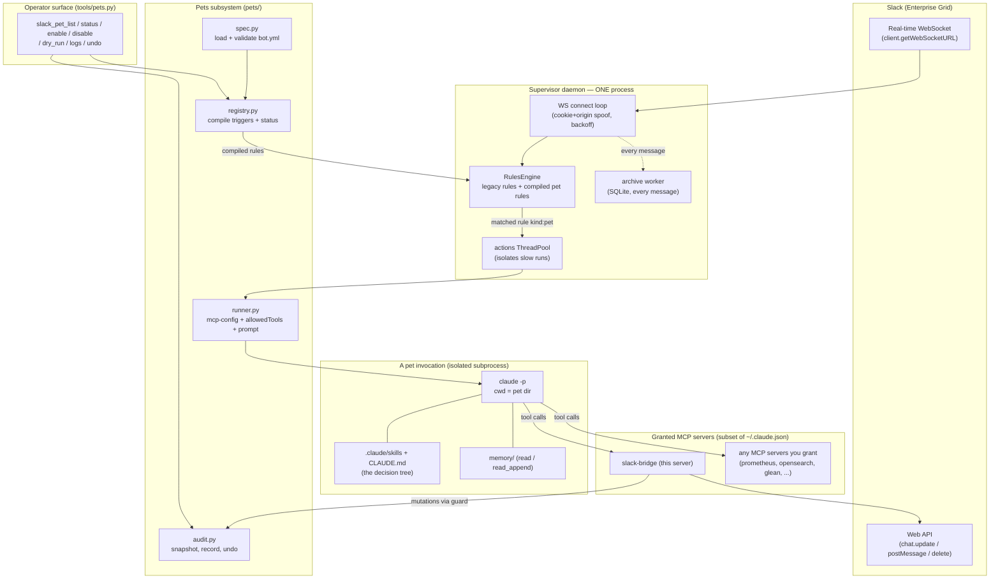
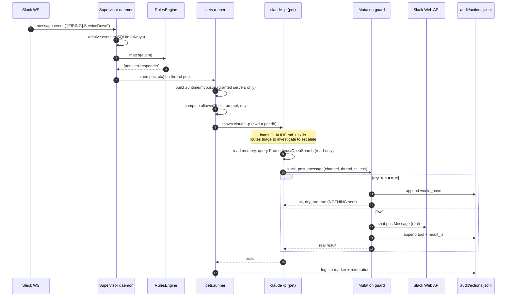
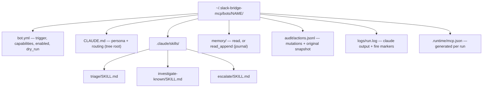
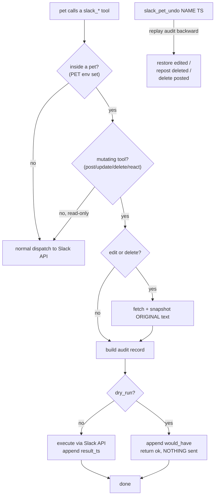
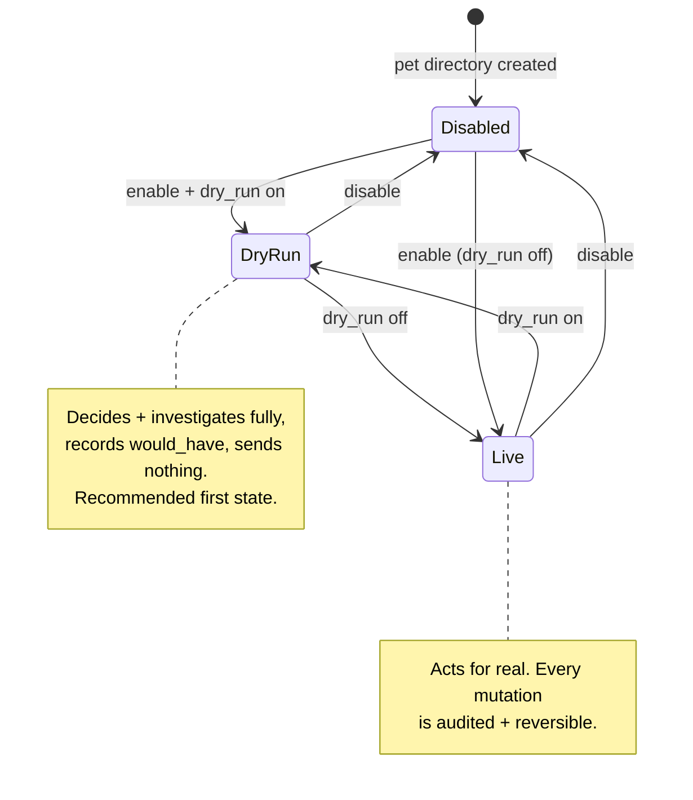
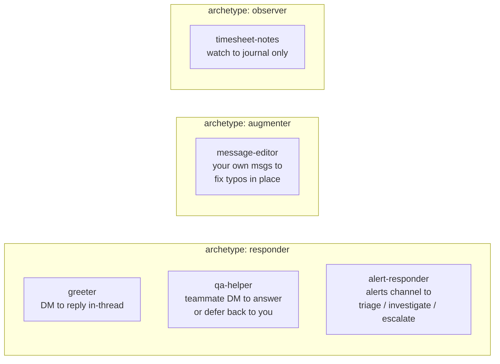

# Slack Pets — Architecture

This document describes the architecture of the **Slack Pets** framework: a system
for running long-lived, configurable, transparent AI agents ("pets") that augment
your Slack experience. It complements [pets-framework.md](pets-framework.md) (the
user/author guide) with the *why* and *how it fits together*.

---

## 1. The core idea in one sentence

> A **pet** is a headless `claude -p` agent whose **behavior tree** is a `.claude/skills/`
> directory + a `CLAUDE.md` persona, with a **configurable grant** of memory, MCP servers,
> and Slack tools — and the framework is the supervisor, spec format, lifecycle, and safety
> rails around running these agents in response to Slack events.

The key inversion from the original clandestine bot: behavior is **not** baked into a shell
script. It lives in declarative specs + skill trees the model routes through. The framework
just decides *which* pet wakes up, runs it safely, and records everything.

---

## 2. Layered component view



**Reading it:** the supervisor owns the single WebSocket and the rule engine. A pet is just a
rule whose action is `kind: pet`. When it matches, the runner launches an isolated
`claude -p` whose skills decide what to do; its Slack mutations route back through the
**audit guard** before hitting the API.

---

## 3. Event lifecycle — from alert to action



The pet **posts/edits Slack itself** — the runner never forwards model text to Slack (that
was the original footgun). The model's "output" is the side-effecting tool calls it makes.

---

## 4. Anatomy of a pet (a directory)



`bot.yml` is the only thing the framework parses. `CLAUDE.md` + `.claude/skills/` are loaded
by Claude Code automatically because the pet runs with `cwd` set to this directory — so the
"tree of skills that routes behavior" *is* the native skills mechanism.

---

## 5. How a trigger becomes a live rule

```mermaid
flowchart LR
    A["bot.yml<br/>trigger + enabled + ignore_self<br/>+ rate_limit_per_min"]
    A -->|spec.parse_spec| B["BotSpec (validated)"]
    B -->|registry.compile_rule| C["rule dict<br/>name: pet:NAME<br/>match: trigger<br/>actions: kind=pet"]
    C -->|RulesEngine.maybe_reload| D["merged rule set<br/>legacy + enabled pet rules"]
    D -->|match(event)| E["fire to kind:pet action to runner.run"]
    F["watcher-rules.yml<br/>(legacy shell/webhook rules)"] -->|_load_legacy| D
```

`maybe_reload()` reloads when **either** source changes: the legacy file's mtime, or the max
mtime across all `bot.yml` files (`registry.signature()`). So `slack_pet_enable/disable`
(which patches `enabled` in `bot.yml`) is picked up automatically — typically within ~50
events.

---

## 6. The safety model — mutation guard + dry-run + undo

Every Slack mutation funnels through one chokepoint: `tools.dispatch`. This is what makes
"auto-edit in place" safe and pets transparent.



Guarantees this gives you:

- **Reversible**: edits/deletes snapshot the original first → `slack_pet_undo` restores it.
- **Vettable**: `dry_run` records exactly what a pet *would* do without touching Slack.
- **Transparent**: `audit/actions.jsonl` is the full, per-pet record; `slack_pet_logs` tails it.
- **Scoped**: a pet only gets the MCP servers + tools its `bot.yml` grants — nothing else.
- **Isolated**: each invocation is its own subprocess; a hang/crash can't take down the fleet.

---

## 7. Pet lifecycle states



Recommended onboarding for a new/mutating pet: **Disabled → DryRun → (read the audit) → Live.**

---

## 8. Example pet patterns

Pets are your own runtime data (in `$SLACK_BRIDGE_BOTS_DIR`), not part of this repo.
These patterns map cleanly onto the three archetypes:



| Pet | Archetype | Trigger | Acts |
|-----|-----------|---------|------|
| `greeter` | responder | a DM or channel | reply in-thread |
| `qa-helper` | responder | a teammate's DM | answer / defer back to you |
| `message-editor` | augmenter | your own msgs in a channel | edit in place (reversible) |
| `alert-responder` | responder | an alerts channel (`FIRING`) | investigate / fix-known / escalate |
| `timesheet-notes` | observer | your after-hours activity | journal only (no Slack write) |

Start every pet disabled + dry-run; vet the audit before going live.

---

## 9. Design decisions & their rationale

| Decision | Why |
|----------|-----|
| One supervisor, many pets (not one daemon per pet) | One WS connection; cheap; pets are configs, not processes. "Running" = enabled spec. |
| Pet = isolated `claude -p` subprocess per fire | Crash-safe, no shared state, natural timeout; the proven model from the original bot. |
| Behavior tree = `.claude/skills/` + `CLAUDE.md` | Reuses Claude Code's native skill routing — no bespoke DSL. The pet *is* a mini Claude Code project. |
| Capabilities are an explicit grant in `bot.yml` | Least privilege: a pet can only reach the MCPs/tools it's given. |
| Single mutation chokepoint in `tools.dispatch` | One place to enforce audit + dry-run for **every** Slack write, including `post_dm` in another module. |
| Snapshot-before-mutate | Makes auto-edit-in-place reversible; without it, undo is impossible. |
| Specs reloaded fresh at fire time | `dry_run`/capability edits take effect immediately, no restart. |
| Supervisor = the existing watcher entrypoint | No second daemon to run; legacy rules + pets coexist over one socket. |

---

## 10. Where things live (source map)

| Path | Role |
|------|------|
| `src/slack_bridge_mcp/pets/spec.py` | `BotSpec` + validation; tool-name resolution |
| `src/slack_bridge_mcp/pets/registry.py` | discover pets, compile rules, status, enable/disable |
| `src/slack_bridge_mcp/pets/runner.py` | build mcp-config + allowedTools + prompt; run `claude -p` |
| `src/slack_bridge_mcp/pets/audit.py` | snapshot, record, undo |
| `src/slack_bridge_mcp/tools/pets.py` | MCP control tools (`slack_pet_*`) |
| `src/slack_bridge_mcp/tools/__init__.py` | central mutation guard + registry wiring |
| `src/slack_bridge_mcp/watcher/daemon.py`, `rules.py`, `actions.py` | supervisor: WS, rule engine (+pets), `kind:pet` action |
| `src/slack_bridge_mcp/config.py` | `bots_dir`, `pets_log_dir` settings |
| `~/.slack-bridge-mcp/bots/NAME/` | the pets themselves (runtime data, not in the repo) |
```
